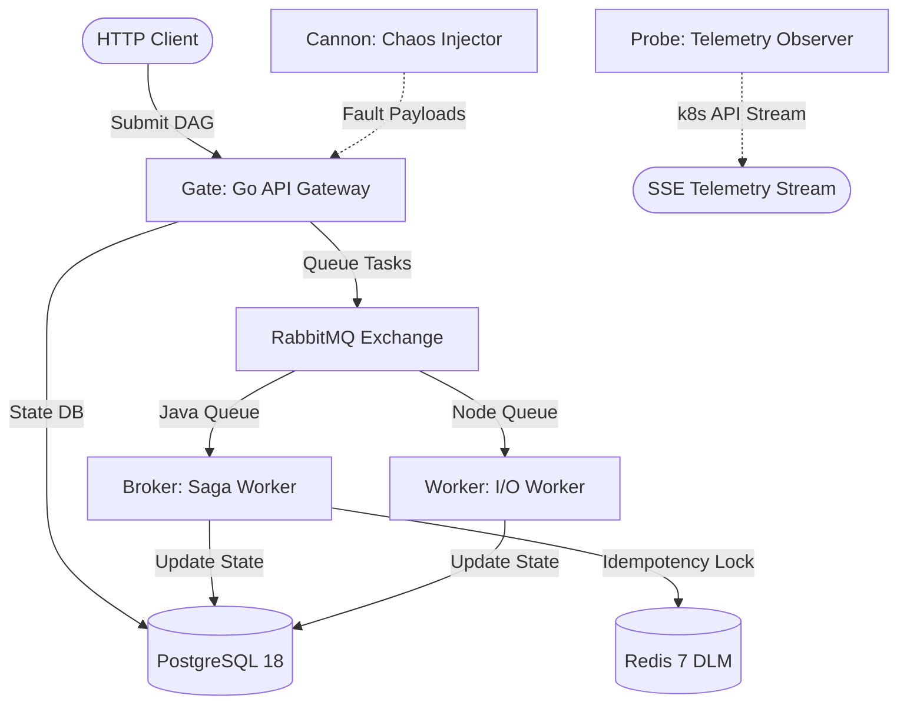

# REDDO 🚀
### Resilient Event-Driven DAG Orchestrator

REDDO is a high-performance, polyglot distributed system designed to execute, monitor, and recover complex Directed Acyclic Graph (DAG) workflows. Built with resilience at its core, it features deterministic fault injection, distributed locking, and transactional sagas.

---

## 🏛️ System Architecture

The orchestrator is composed of five microservices communicating via message-queuing and database state tracking:



1. **Gateway/Coordinator (`Gate`)**: Written in Go (Fiber/Gin). Responsible for receiving, validating DAG structures using **Kahn's Algorithm** for circular dependency checks, persisting workflow definitions to PostgreSQL, and queuing initial tasks.
2. **Transactional Worker (`Broker`)**: Written in Java 25 (Spring Boot + Virtual Threads). Listens to RabbitMQ, handles workflow execution steps, utilizes Redis for distributed locks (`SETNX`) to guarantee idempotency, and implements the **Saga Pattern** for transaction rollbacks.
3. **I/O Worker (`Worker`)**: Written in Node.js 24 (TypeScript + pnpm). Executes network and disk tasks, responding to fault instructions by triggering crashes or freezes.
4. **Chaos Cannon (`Cannon`)**: Written in Go. A fault injector CLI that shuffles payloads using the **Fisher-Yates** algorithm to test downstream recovery paths deterministically.
5. **Telemetry Observer (`Probe`)**: Written in Go. Uses `client-go` to poll Kubernetes resource statistics and RabbitMQ queue metrics, streaming telemetry data via Server-Sent Events (SSE).

---

## ⚙️ Stateful Infrastructure (Phase 1 Complete)

All backing data stores run locally under a dedicated `reddo` namespace in Kubernetes (Kind/Podman) with strict memory bounds to optimize running on local 16GB machines:

* **PostgreSQL 18** (`postgres:18-alpine`): Stores workflow definitions, state transitions, and execution histories using JSONB columns. (Memory: `128Mi` request / `256Mi` limit)
* **RabbitMQ v4** (`rabbitmq:4-management-alpine`): Coordinates event communication between workers. (Memory: `128Mi` request / `256Mi` limit)
* **Redis 7** (`redis:7-alpine`): Acts as the Distributed Lock Manager (DLM) to enforce single-worker execution of tasks. (Memory: `64Mi` request / `128Mi` limit)

---

## 📁 Project Directory Structure

```text
REDDO/
├── db/
│   └── patches/
│       └── 001_init.sql         # Single source of truth for Postgres schema
├── k8s/
│   ├── namespace.yaml           # Isolates the cluster resources
│   ├── postgres.yaml            # PostgreSQL StatefulSet & Cluster Service
│   ├── rabbitmq.yaml            # RabbitMQ Deployment & Cluster Service (Management panel)
│   └── redis.yaml               # Redis Deployment & Cluster Service
├── scripts/
│   └── manage_infra.js          # Cross-platform infrastructure manager
├── .gitignore
├── README.md
└── TUTORIAL_TRACKER.md          # Architectural instructions & progress tracker
```

---

## 🚀 Getting Started

### Prerequisites
* [kubectl](https://kubernetes.io/docs/tasks/tools/)
* [Node.js](https://nodejs.org/) (v20+ recommended)
* A running Kubernetes cluster (e.g. Kind or Minikube) configured with your local shell context.

### 1. Apply Manifests
Deploy the namespace and backing services to your Kubernetes cluster:
```bash
kubectl apply -f k8s/namespace.yaml
kubectl apply -f k8s/postgres.yaml -f k8s/redis.yaml -f k8s/rabbitmq.yaml
```

Verify all pods transition to `Running`:
```bash
kubectl get pods -n reddo
```

### 2. Manage Infrastructure via Script
You can stop, start, or restart the infrastructure pods using the Node script located in the `scripts` directory:

* **Stop Services** (scales replicas to 0):
  ```bash
  node scripts/manage_infra.js stop
  ```
* **Start Services** (scales replicas to 1):
  ```bash
  node scripts/manage_infra.js start
  ```
* **Restart Services** (performs scale-down, waits 5s, and scales up):
  ```bash
  node scripts/manage_infra.js restart
  ```

### 3. API Testing (Insomnia)
For executing and testing API endpoints across REDDO services, an Insomnia collection is maintained in the project.
* Import the collection file [insomnia/REDDO.insomnia_collection.json](file:///d:/Coding%20Projects/REDDO/insomnia/REDDO.insomnia_collection.json) into your Insomnia workspace.
* Configure the base environment variable `base_url` (defaults to `http://localhost:8080` for local development).

---

## 💾 Schema Migrations (Patches)
Database migrations are kept under the `db/patches` directory. Rather than mounting static configuration scripts in the container, the Go Coordinator (`Gate`) will parse and execute outstanding patches in numerical order upon starting up, creating the `schema_migrations` tracking table automatically.

---

## 🧱 Built Microservices

### 🟢 1. Go API Gateway (`gate`)
The ingress API coordinator for REDDO.
* **Technology**: Go 1.26, Fiber v2, pgx/v5, amqp091-go
* **Key Features**:
  * **Auto-Migrations**: Automatically runs outstanding SQL patches in numerical order on startup.
  * **Kahn's Graph Validation**: Validates submitted DAGs for circular dependencies and orphan tasks in $\mathcal{O}(V+E)$ time.
  * **Transactional Persistence**: Writes workflow instance and task executions inside atomic SQL transactions.
  * **Declarative AMQP Topology**: Idempotently declares exchange (`workflow-exchange`), queues (`java-tasks`, `node-tasks`), and bindings on boot.
  * **Minimal Image Size**: Compiles a statically linked binary packaged in a minimal Alpine image (31.8 MB).
